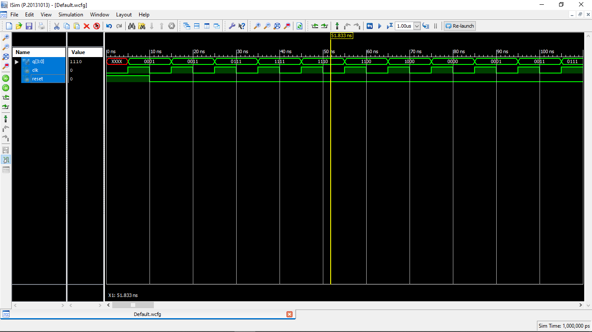

[English Version](README.en.md)

# ماژول شمارشگر ۴ بیتی در Verilog



## مرور کلی

این مخزن شامل پیاده‌سازی یک ماژول شمارشگر ۴ بیتی (`Counter4Bit`) به زبان Verilog است. این ماژول برای افزایش مقدار شمارش باینری ۴ بیتی در هر لبه مثبت سیگنال کلاک طراحی شده است و دارای قابلیت ریست سنکرون برای مقداردهی اولیه شمارشگر به حالت مشخص است. این طراحی برای اهداف آموزشی مناسب بوده و می‌تواند به عنوان یک جزء پایه در دروس طراحی سیستم‌های دیجیتال یا پروژه‌های مرتبط استفاده شود.

## توضیحات ماژول

ماژول `Counter4Bit` یک شمارشگر سنکرون ۴ بیتی است که در لبه مثبت سیگنال کلاک (`clk`) عمل می‌کند. این ماژول شامل یک ورودی ریست (`reset`) برای مقداردهی اولیه شمارشگر و یک خروجی ۴ بیتی (`q`) برای نمایش مقدار شمارش است. شمارشگر از یک مکانیزم بازخورد برای تولید حالت بعدی استفاده می‌کند و یک توالی شمارش از ۰ تا ۱۵ (در مبنای باینری) را تضمین می‌کند.

### ورودی‌ها و خروجی‌ها
- **ورودی‌ها**:
  - `clk`: سیگنال کلاک (فعال در لبه مثبت).
  - `reset`: سیگنال ریست سنکرون (فعال در سطح بالا).
- **خروجی‌ها**:
  - `q[3:0]`: خروجی ۴ بیتی که مقدار شمارش جاری را نشان می‌دهد.

### عملکرد
- در هر لبه مثبت کلاک، شمارشگر حالت خود را بر اساس منطق بازخورد به‌روزرسانی می‌کند.
- هنگامی که سیگنال `reset` در سطح بالا باشد، شمارشگر به حالت اولیه `q = 4'b1000` (باینری ۸) تنظیم می‌شود.
- در غیر این صورت، شمارشگر بیت‌ها را به صورت چرخشی جابجا می‌کند و در نتیجه یک توالی شمارش را پیاده‌سازی می‌کند.

## جزئیات طراحی

این ماژول از چهار فلیپ‌فلاپ (`q0`, `q1`, `q2`, `q3`) برای ذخیره حالت شمارشگر استفاده می‌کند. منطق حالت بعدی با استفاده از تخصیص‌های ترکیبی (`d0`, `d1`, `d2`, `d3`) پیاده‌سازی شده است، به طوری که:
- `d0 = ~q3`
- `d1 = q0`
- `d2 = q1`
- `d3 = q2`

خروجی `q` از طریق الحاق حالت‌های فلیپ‌فلاپ‌ها به صورت `{q3, q2, q1, q0}` تشکیل می‌شود. شمارشگر با مقیاس زمانی ۱ نانوثانیه / ۱ پیکوثانیه عمل می‌کند، همان‌طور که در دستور مقیاس زمانی Verilog مشخص شده است.

## نحوه استفاده

برای استفاده از این ماژول در یک پروژه Verilog:
1. فایل `Counter4Bit.v` را در دایرکتوری پروژه خود قرار دهید.
2. ماژول را در طراحی سطح بالای خود نمونه‌سازی کنید و پورت‌های `clk`، `reset` و `q` را به طور مناسب متصل کنید.
3. اطمینان حاصل کنید که سیگنال کلاک به درستی هدایت می‌شود و سیگنال ریست برای مقداردهی اولیه شمارشگر کنترل می‌شود.

### نمونه کد نمونه‌سازی
```verilog
Counter4Bit counter (
    .clk(clk),
    .reset(reset),
    .q(count)
);
```

## شبیه‌سازی و آزمایش

برای تأیید عملکرد شمارشگر، باید یک تست‌بنچ طراحی شود که:
- سیگنال `clk` را با دوره ثابت (مثلاً ۱۰ نانوثانیه) هدایت کند.
- سیگنال `reset` را برای یک سیکل کلاک فعال کند تا شمارشگر مقداردهی اولیه شود.
- خروجی `q` را در چندین سیکل کلاک مشاهده کند تا توالی شمارش تأیید شود.
